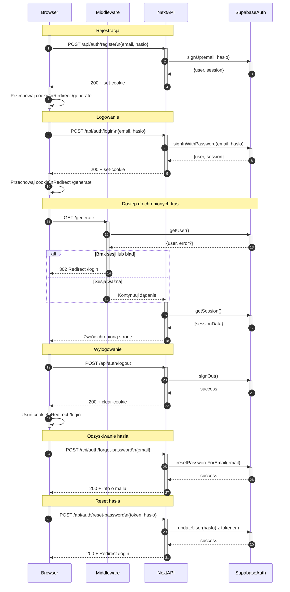

# Diagram Mermaid - Architektura Autentykacji

Diagram przedstawia przepływ autentykacji dla modułu logowania i rejestracji w aplikacji 10xCards.

```mermaid
sequenceDiagram
  autonumber
  participant Browser
  participant Middleware
  participant NextAPI
  participant SupabaseAuth

  Note over Browser,NextAPI: Rejestracja
  activate Browser
  Browser->>NextAPI: POST /api/auth/register\n{email, hasło}
  deactivate Browser
  activate NextAPI
  NextAPI->>SupabaseAuth: signUp(email, hasło)
  activate SupabaseAuth
  SupabaseAuth-->>NextAPI: {user, session}
  deactivate SupabaseAuth
  NextAPI-->>Browser: 200 + set-cookie
  deactivate NextAPI
  activate Browser
  Browser->>Browser: Przechowaj cookie\nRedirect /generate
  deactivate Browser

  Note over Browser,NextAPI: Logowanie
  activate Browser
  Browser->>NextAPI: POST /api/auth/login\n{email, hasło}
  deactivate Browser
  activate NextAPI
  NextAPI->>SupabaseAuth: signInWithPassword(email, hasło)
  activate SupabaseAuth
  SupabaseAuth-->>NextAPI: {user, session}
  deactivate SupabaseAuth
  NextAPI-->>Browser: 200 + set-cookie
  deactivate NextAPI
  activate Browser
  Browser->>Browser: Przechowaj cookie\nRedirect /generate
  deactivate Browser

  Note over Browser,SupabaseAuth: Dostęp do chronionych tras
  activate Browser
  Browser->>Middleware: GET /generate
  deactivate Browser
  activate Middleware
  Middleware->>SupabaseAuth: getUser()
  activate SupabaseAuth
  SupabaseAuth-->>Middleware: {user, error?}
  deactivate SupabaseAuth
  alt Brak sesji lub błąd
    Middleware-->>Browser: 302 Redirect /login
  else Sesja ważna
    Middleware-->>NextAPI: Kontynuuj żądanie
  end
  deactivate Middleware

  activate NextAPI
  NextAPI->>SupabaseAuth: getSession()
  activate SupabaseAuth
  SupabaseAuth-->>NextAPI: {sessionData}
  deactivate SupabaseAuth
  NextAPI-->>Browser: Zwróć chronioną stronę
  deactivate NextAPI

  Note over Browser,NextAPI: Wylogowanie
  activate Browser
  Browser->>NextAPI: POST /api/auth/logout
  deactivate Browser
  activate NextAPI
  NextAPI->>SupabaseAuth: signOut()
  activate SupabaseAuth
  SupabaseAuth-->>NextAPI: success
  deactivate SupabaseAuth
  NextAPI-->>Browser: 200 + clear-cookie
  deactivate NextAPI
  activate Browser
  Browser->>Browser: Usuń cookie\nRedirect /login
  deactivate Browser

  Note over Browser,NextAPI: Odzyskiwanie hasła
  activate Browser
  Browser->>NextAPI: POST /api/auth/forgot-password\n{email}
  deactivate Browser
  activate NextAPI
  NextAPI->>SupabaseAuth: resetPasswordForEmail(email)
  activate SupabaseAuth
  SupabaseAuth-->>NextAPI: success
  deactivate SupabaseAuth
  NextAPI-->>Browser: 200 + info o mailu
  deactivate NextAPI

  Note over Browser,NextAPI: Reset hasła
  activate Browser
  Browser->>NextAPI: POST /api/auth/reset-password\n{token, hasło}
  deactivate Browser
  activate NextAPI
  NextAPI->>SupabaseAuth: updateUser(hasło) z tokenem
  activate SupabaseAuth
  SupabaseAuth-->>NextAPI: success
  deactivate SupabaseAuth
  NextAPI-->>Browser: 200 + Redirect /login
  deactivate NextAPI
```
