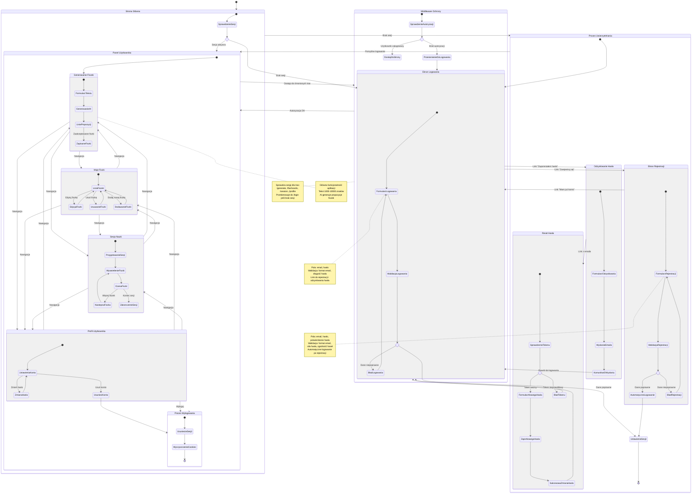

# Diagram Mermaid - Podróż Użytkownika

Diagram przedstawia kompleksową podróż użytkownika dla modułu logowania i rejestracji w aplikacji 10xCards, uwzględniając wszystkie ścieżki uwierzytelniania i główne funkcjonalności aplikacji.

## Opis głównych ścieżek użytkownika

### 1. Nowy użytkownik (US-001)

- **Punkt wejścia**: Strona główna bez sesji
- **Ścieżka**: Strona główna → Ekran logowania → Link rejestracji → Formularz rejestracji → Automatyczne logowanie → Panel użytkownika
- **Cel**: Utworzenie konta i natychmiastowy dostęp do aplikacji

### 2. Powracający użytkownik (US-002)

- **Punkt wejścia**: Strona główna lub bezpośredni link
- **Ścieżka**: Sprawdzenie sesji → Ekran logowania (jeśli brak sesji) → Formularz logowania → Panel użytkownika
- **Cel**: Szybkie uwierzytelnienie i dostęp do funkcji

### 3. Odzyskiwanie dostępu

- **Punkt wejścia**: Ekran logowania
- **Ścieżka**: Link "Zapomniałem hasła" → Formularz odzyskiwania → Email z linkiem → Reset hasła → Powrót do logowania
- **Cel**: Przywrócenie dostępu do konta

### 4. Korzystanie z aplikacji

- **Punkt wejścia**: Panel użytkownika po zalogowaniu
- **Ścieżki**: Generowanie fiszek ↔ Moje fiszki ↔ Sesja nauki ↔ Profil
- **Cel**: Efektywne zarządzanie fiszkami i nauka

### 5. Bezpieczne zakończenie sesji

- **Punkt wejścia**: Dowolna strona w panelu użytkownika
- **Ścieżka**: Przycisk wylogowania → Usunięcie sesji → Strona główna
- **Cel**: Bezpieczne zakończenie pracy z aplikacją

## Kluczowe punkty decyzyjne

1. **Sprawdzenie sesji**: Czy użytkownik jest już zalogowany?
2. **Walidacja danych**: Czy wprowadzone dane są poprawne?
3. **Autoryzacja**: Czy użytkownik ma dostęp do żądanej strony?
4. **Token resetu**: Czy link do zmiany hasła jest ważny?

## Zabezpieczenia i UX

- **Middleware ochrony**: Automatyczne przekierowanie do logowania dla chronionych tras
- **Walidacja formularzy**: Sprawdzanie danych po stronie klienta i serwera
- **Komunikaty błędów**: Czytelne informacje o problemach
- **Responsywność**: Dostosowanie do różnych urządzeń
- **Dostępność**: Obsługa klawiatury i czytników ekranu
