# Diagram Mermaid - Architektura UI Komponentów

Diagram przedstawia architekturę interfejsu użytkownika dla modułu logowania i rejestracji w aplikacji 10xCards, obejmując strony, komponenty, formularze, API routes, middleware oraz integrację z Supabase Auth.

```mermaid
flowchart TD
    subgraph "Strony Autentykacji"
        A["Strona Logowania<br/>/login"]
        B["Strona Rejestracji<br/>/register"]
        C["Strona Odzyskiwania Hasła<br/>/forgot-password"]
        D["Strona Resetu Hasła<br/>/reset-password"]
    end

    subgraph "Layout Autentykacji"
        E["AuthLayout<br/>src/app/(auth)/layout.tsx"]
    end

    subgraph "Komponenty Formularzy"
        F["LoginForm<br/>src/components/auth/LoginForm.tsx"]
        G["RegisterForm<br/>src/components/auth/RegisterForm.tsx"]
        H["ForgotPasswordForm<br/>src/components/auth/ForgotPasswordForm.tsx"]
        I["ResetPasswordForm<br/>src/components/auth/ResetPasswordForm.tsx"]
    end

    subgraph "Komponenty UI Wspólne"
        J["FormInput<br/>src/components/ui/"]
        K["FormButton<br/>src/components/ui/"]
        L["FormError<br/>src/components/ui/"]
        M["ToastNotification<br/>Globalne komunikaty"]
        N["PasswordMeter<br/>Opcjonalnie"]
    end

    subgraph "API Routes"
        O["POST /api/auth/register<br/>Rejestracja użytkownika"]
        P["POST /api/auth/login<br/>Logowanie użytkownika"]
        Q["POST /api/auth/logout<br/>Wylogowanie użytkownika"]
        R["POST /api/auth/forgot-password<br/>Żądanie resetu hasła"]
        S["POST /api/auth/reset-password<br/>Ustawienie nowego hasła"]
    end

    subgraph "Walidacja i Schematy"
        T["Schematy Zod<br/>src/lib/schemas/auth.ts"]
        U["React Hook Form<br/>Integracja z walidacją"]
        V["Typy TypeScript<br/>src/lib/types/auth.ts"]
    end

    subgraph "Serwisy"
        W["AuthService<br/>src/lib/services/authService.ts"]
        X["Supabase Client<br/>src/utils/supabase/server.ts"]
        Y["Supabase Middleware<br/>src/utils/supabase/middleware.ts"]
    end

    subgraph "Middleware i Ochrona"
        Z["Główny Middleware<br/>middleware.ts"]
        AA["Ochrona Tras<br/>Przekierowanie do /login"]
        BB["Sprawdzanie Sesji<br/>Supabase Auth"]
    end

    subgraph "Chronione Strony"
        CC["MainLayout<br/>src/app/layout.tsx"]
        DD["Strona Generowania<br/>/generate"]
        EE["Moje Fiszki<br/>/flashcards"]
        FF["Sesja Nauki<br/>/session"]
        GG["Profil<br/>/profile"]
    end

    subgraph "Nawigacja"
        HH["Górne Menu<br/>Generowanie, Fiszki, Sesja, Profil"]
        II["Przycisk Wyloguj<br/>Wywołanie logout"]
        JJ["Menu Mobilne<br/>Hamburger menu"]
    end

    subgraph "Supabase Auth"
        KK["Supabase Authentication<br/>Zewnętrzny serwis"]
        LL["Zarządzanie Sesjami<br/>JWT Tokens"]
        MM["Resetowanie Haseł<br/>Email links"]
    end

    %% Połączenia między stronami a layoutem
    A --> E
    B --> E
    C --> E
    D --> E

    %% Połączenia stron z formularzami
    A --> F
    B --> G
    C --> H
    D --> I

    %% Formularze używają komponentów UI
    F --> J
    F --> K
    F --> L
    G --> J
    G --> K
    G --> L
    G --> N
    H --> J
    H --> K
    H --> L
    I --> J
    I --> K
    I --> L
    I --> N

    %% Formularze komunikują się z API
    F --> P
    G --> O
    H --> R
    I --> S

    %% API używa walidacji i serwisów
    O --> T
    P --> T
    Q --> T
    R --> T
    S --> T

    O --> W
    P --> W
    Q --> W
    R --> W
    S --> W

    %% Serwisy komunikują się z Supabase
    W --> X
    W --> KK

    %% API komunikuje się z Supabase Auth
    O --> KK
    P --> KK
    Q --> KK
    R --> KK
    S --> KK

    %% Supabase Auth zarządza sesjami
    KK --> LL
    KK --> MM

    %% Middleware chroni trasy
    Z --> Y
    Z --> AA
    Y --> BB
    BB --> KK

    %% Przekierowania po autentykacji
    P --> DD
    O --> DD
    AA --> A

    %% Chronione strony używają MainLayout
    DD --> CC
    EE --> CC
    FF --> CC
    GG --> CC

    %% MainLayout zawiera nawigację
    CC --> HH
    CC --> JJ
    HH --> II

    %% Wylogowanie
    II --> Q

    %% Walidacja używa typów
    T --> V
    F --> U
    G --> U
    H --> U
    I --> U

    %% Komunikaty błędów i sukcesu
    F --> M
    G --> M
    H --> M
    I --> M
    O --> M
    P --> M
    Q --> M
    R --> M
    S --> M

    %% Style dla różnych typów węzłów
    classDef authPage fill:#e1f5fe,stroke:#01579b,stroke-width:2px
    classDef layout fill:#f3e5f5,stroke:#4a148c,stroke-width:2px
    classDef form fill:#e8f5e8,stroke:#1b5e20,stroke-width:2px
    classDef ui fill:#fff3e0,stroke:#e65100,stroke-width:2px
    classDef api fill:#fce4ec,stroke:#880e4f,stroke-width:2px
    classDef service fill:#f1f8e9,stroke:#33691e,stroke-width:2px
    classDef middleware fill:#e0f2f1,stroke:#004d40,stroke-width:2px
    classDef protected fill:#e8eaf6,stroke:#1a237e,stroke-width:2px
    classDef supabase fill:#ffebee,stroke:#b71c1c,stroke-width:2px

    class A,B,C,D authPage
    class E,CC layout
    class F,G,H,I form
    class J,K,L,M,N ui
    class O,P,Q,R,S api
    class T,U,V,W,X,Y service
    class Z,AA,BB middleware
    class DD,EE,FF,GG,HH,II,JJ protected
    class KK,LL,MM supabase
```

## Opis architektury

### Główne moduły:

1. **Strony Autentykacji** - Dedykowane strony dla procesów logowania, rejestracji i odzyskiwania hasła
2. **Layout Autentykacji** - Wspólny layout dla stron autentykacji z minimalną nawigacją
3. **Komponenty Formularzy** - Specjalizowane formularze dla każdego procesu autentykacji
4. **Komponenty UI Wspólne** - Reużywalne komponenty interfejsu użytkownika
5. **API Routes** - Endpointy backend obsługujące procesy autentykacji
6. **Walidacja i Schematy** - System walidacji danych z użyciem Zod i TypeScript
7. **Serwisy** - Warstwa abstrakcji dla komunikacji z Supabase
8. **Middleware i Ochrona** - System ochrony tras i zarządzania sesjami
9. **Chronione Strony** - Główne funkcjonalności aplikacji dostępne po autentykacji
10. **Nawigacja** - System nawigacji dla zalogowanych użytkowników
11. **Supabase Auth** - Zewnętrzny serwis autentykacji

### Przepływ danych:

- Użytkownik wypełnia formularz → walidacja → API route → Supabase Auth → sesja/cookie → przekierowanie
- Middleware sprawdza sesję dla każdego żądania do chronionych tras
- Komunikaty błędów i sukcesu wyświetlane przez system toast notifications
- Automatyczne przekierowania w zależności od stanu autentykacji użytkownika
